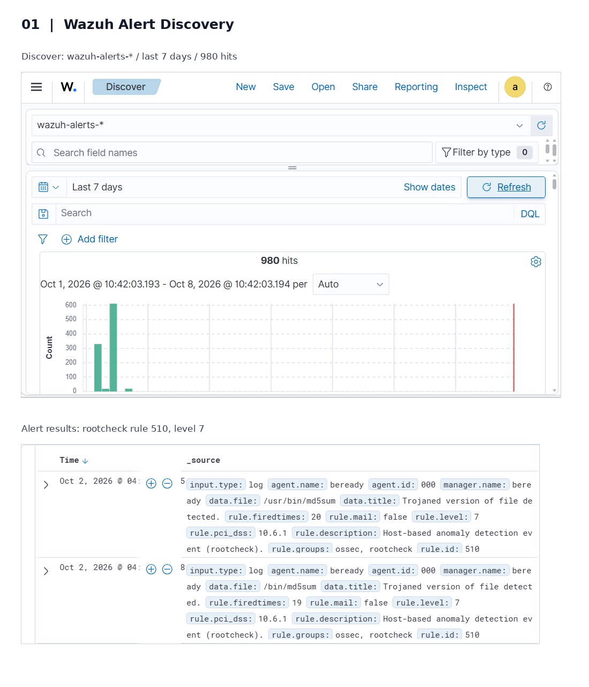
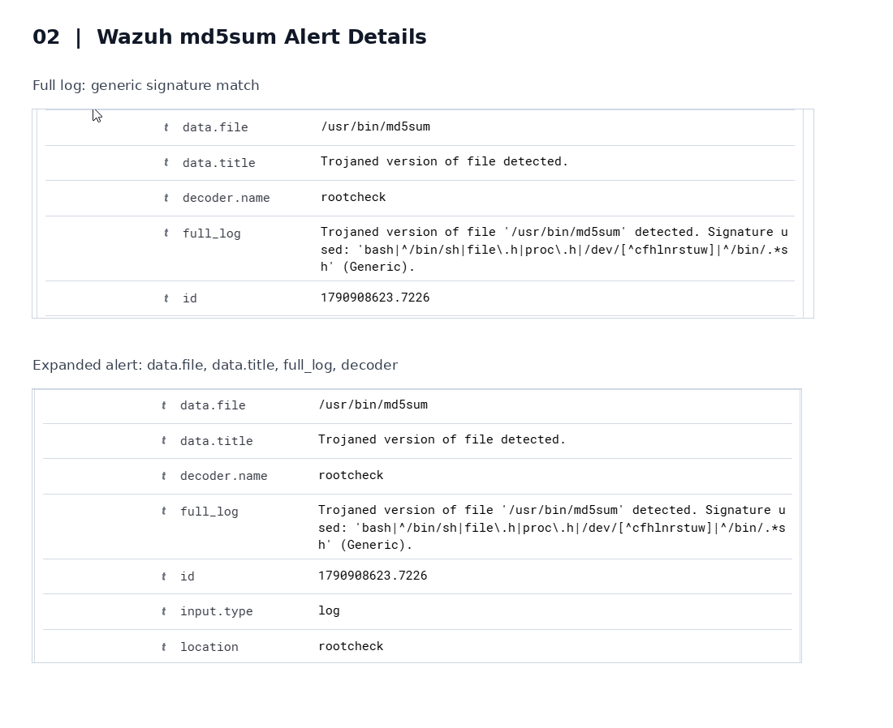
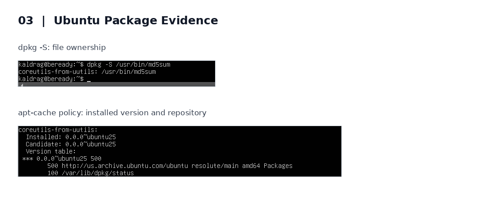

# SOC Investigation: Suspicious md5sum File Detection

## 1. Trigger
While reviewing security alerts in Wazuh, I discovered a "Trojaned version of file detected" 
alert involving `/usr/bin/md5sum` on my Ubuntu Server.

## 2. Alert Observed
- **Severity:** Level 7
- **Rule ID:** 510
- **Affected File:** `/usr/bin/md5sum`
- **Affected System:** Ubuntu Server
- **Alert Timestamp:** October 2, 2026, 4:37 (timezone not yet confirmed)

## 3. Investigation
I used the `dpkg -S /usr/bin/md5sum` command to identify which installed software package owned the flagged file. 
The result showed that it belonged to `coreutils-from-uutils`.

I ran `sudo dpkg --verify coreutils-from-uutils` to check the integrity of the installed package files. 
The command returned no output, indicating that no integrity mismatches were reported. 
This suggests the file had not been modified from its recorded package state.

I ran `apt-cache policy coreutils-from-uutils` to examine the installed package version and available repositories. 
The output showed version `0.0.0~ubuntu25` and listed the official Ubuntu repository `us.archive.ubuntu.com`. 
This supported the possibility that the file was legitimate, although it did not independently confirm the original installation source.

I reviewed the Wazuh alert's detection signature, which included references to `bash`, `/bin/sh`, and `/proc`. 
These strings can appear in legitimate software as well as malicious programs. 
Since package verification reported no mismatches, I could not confirm that the file had been compromised.

## 4. Evidence

### Evidence 1 — Wazuh Alert Discovery

### Evidence 2 — Wazuh Alert Details

### Evidence 3 — Ubuntu Package Verification

## 5. Conclusion

I classified this alert as a likely false positive.
Ubuntu's package verification reported no integrity mismatches, and the package was available from an official Ubuntu repository. 
Additionally, the suspicious strings detected by Wazuh can appear in legitimate software.
Based on the available evidence, I found no confirmation that the file was compromised.

## 6. Next Step

I recommend continuing to monitor the Ubuntu Server for suspicious activity involving `/usr/bin/md5sum`.
If additional alerts occur, particularly with different detection signatures or increased severity, I would reopen the investigation and review the new evidence.
